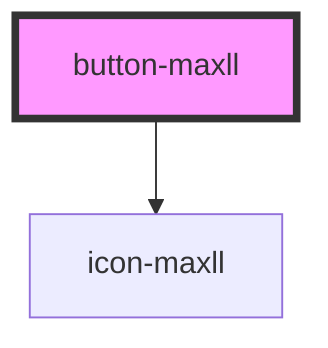

# button-maxll

<!-- Auto Generated Below -->

## Properties

| Property   | Attribute  | Description | Type                                                                                                                                                                                | Default     |
| ---------- | ---------- | ----------- | ----------------------------------------------------------------------------------------------------------------------------------------------------------------------------------- | ----------- |
| `color`    | `color`    |             | `Colors.Danger \| Colors.Ghost \| Colors.Info \| Colors.Light \| Colors.MaxiBlue \| Colors.MaxiBlueAcent \| Colors.Primary \| Colors.Secondary \| Colors.Success \| Colors.Warning` | `undefined` |
| `disabled` | `disabled` |             | `boolean`                                                                                                                                                                           | `undefined` |
| `icon`     | `icon`     |             | `IconName`                                                                                                                                                                          | `undefined` |
| `size`     | `size`     |             | `Sizes.Large \| Sizes.Medium \| Sizes.Small \| Sizes.Xs`                                                                                                                            | `undefined` |
| `variant`  | `variant`  |             | `Variants.Block \| Variants.Icon \| Variants.Normal \| Variants.Outline \| Variants.Rounded`                                                                                        | `undefined` |

## Dependencies

### Depends on

- [icon-maxll](../Icon)

### Graph

----------------------------------------------

*Built with [StencilJS](https://stenciljs.com/)*
