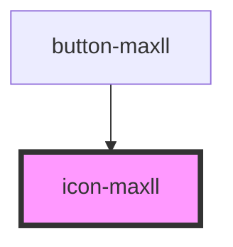

# icon-maxll

<!-- Auto Generated Below -->

## Properties

| Property  | Attribute | Description | Type                                                                    | Default               |
| --------- | --------- | ----------- | ----------------------------------------------------------------------- | --------------------- |
| `color`   | `color`   |             | `Colors.BLACK \| Colors.GRAY \| Colors.WHITE`                           | `Colors.BLACK`        |
| `local`   | `local`   |             | `boolean`                                                               | `false`               |
| `name`    | `name`    |             | `IconName`                                                              | `IconName.ARROW_LEFT` |
| `variant` | `variant` |             | `Variants.LIGHT \| Variants.REGULAR \| Variants.SHARP \| Variants.THIN` | `Variants.REGULAR`    |

## Dependencies

### Used by

 - [button-maxll](../Button)

### Graph

----------------------------------------------

*Built with [StencilJS](https://stenciljs.com/)*
