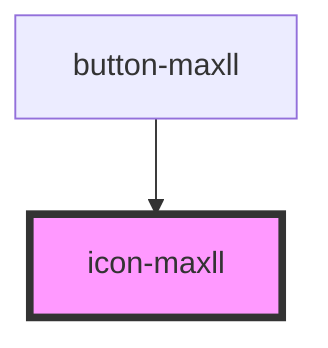

# icon-maxll

<!-- Auto Generated Below -->

## Properties

| Property  | Attribute | Description | Type                                                                    | Default              |
| --------- | --------- | ----------- | ----------------------------------------------------------------------- | -------------------- |
| `color`   | `color`   |             | `Colors.Black \| Colors.Gray \| Colors.White`                           | `Colors.Black`       |
| `local`   | `local`   |             | `boolean`                                                               | `false`              |
| `name`    | `name`    |             | `IconName`                                                              | `IconName.ArrowLeft` |
| `variant` | `variant` |             | `Variants.Light \| Variants.Regular \| Variants.Sharp \| Variants.Thin` | `Variants.Regular`   |

## Dependencies

### Used by

 - [button-maxll](../Button)

### Graph

----------------------------------------------

*Built with [StencilJS](https://stenciljs.com/)*
